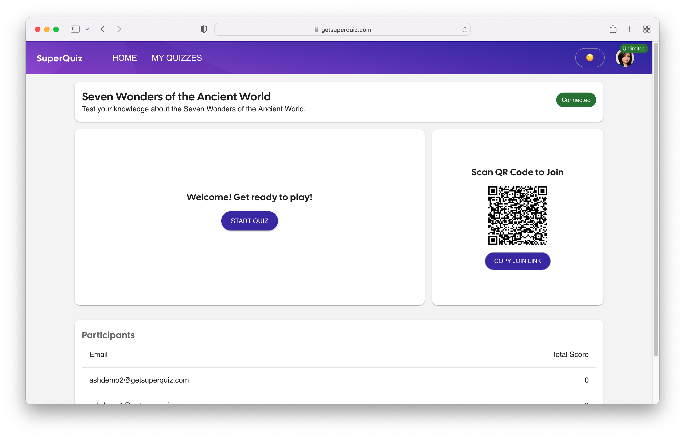

# SuperQuiz

## Author: Ashwini Uppal

AI Generated Custom Multiplayer Quizzes ✨
https://getsuperquiz.com/

Hello, and welcome to SuperQuiz! I'm Ashwini, the creator of this AI-powered multiplayer quiz app. My journey, rooted in education and the pursuit of simplified technology, has inspired me to build a platform that transcends traditional boundaries.
From Classroom to Coding

Before stepping into the tech world, I was devoted to educating the next generation. I witnessed firsthand the challenges that teachers faced in incorporating technology into their classrooms. From cumbersome interfaces to a lack of user-friendly tools, the struggle was real, and it resonated with me deeply.

It wasn't just about making technology more accessible; I realized there was an opportunity to create tools that could enhance learning experiences, foster collaboration, and simplify the complexities of tech integration.

SuperQuiz was born out of a desire to bridge the technology gap in education, but its potential reaches far and wide. From educators crafting interactive quizzes to businesses seeking team-building activities, to families looking for a fun way to connect, this platform offers something for everyone.

SuperQuiz is a platform for creating, presenting, and participating in quizzes. Whether you're crafting a quiz for educational purposes, a fun competition, or testing subject matter expertise, SuperQuiz offers a flexible and interactive platform to meet your needs.

You can create quizzes in SuperQuiz by pasting your own text. SuperQuiz uses AI to extract relevant questions, allowing you to add, remove, or edit questions and the options within those questions to suit your preferences. 

SuperQuiz is easy and doesn't require downloading any additional software or applications. You can participate by scanning a QR code with your mobile phone or clicking the join link for the quiz.

SuperQuiz can be shared on any virtual meeting platform that allows window or screen sharing, such as Zoom, Microsoft Teams, Google Meet, WebEx, Skype, Slack, and more. Organizers can screen-share the quiz window and advance questions as participants vote on answers, providing an engaging experience without needing specialized technical skills.

My vision for SuperQuiz is about building connections, enhancing learning, and creating joyful experiences across all walks of life. It's more than a quiz platform; it's a tool that brings people together, fosters collaboration, and sparks curiosity.

## Screenshots

